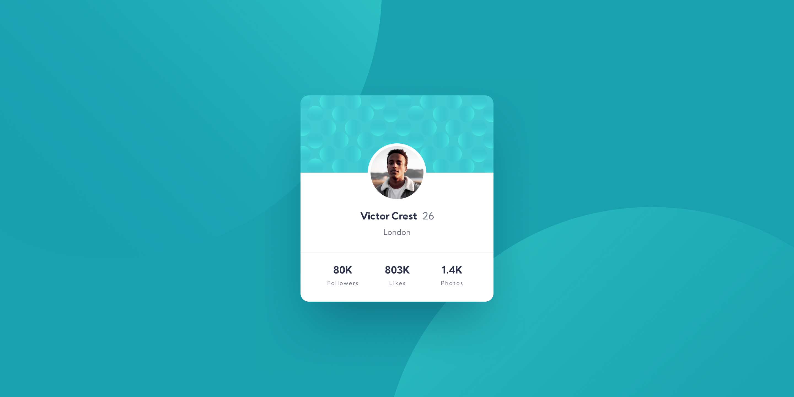

# Frontend Mentor - Profile card component solution

This is a solution to the [Profile card component challenge on Frontend Mentor](https://www.frontendmentor.io/challenges/profile-card-component-cfArpWshJ). Frontend Mentor challenges help you improve your coding skills by building realistic projects. 
## Overview

### Screenshot

### Links

- Solution URL: (https://www.frontendmentor.io/solutions/profile-card-component-solution-rJPkuK6M5)
- Live Site URL: (https://fe-mentor-profile-card.netlify.app)

## My process

### Built with

- Semantic HTML5 markup
- CSS custom properties
- Flexbox
- Mobile-first workflow

### Useful resources

- [MDN](https://developer.mozilla.org/ru/) - MDN is just a generally good resource, that I use every time, either for CSS or JS related topics.
- [CSS-Tricks](https://css-tricks.com) - CSS-Tricks is another amazing resource, that has everything you might need when working with CSS.
